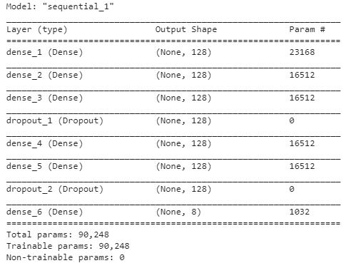
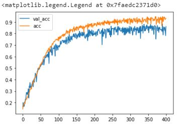
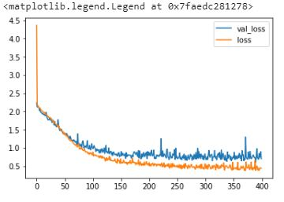
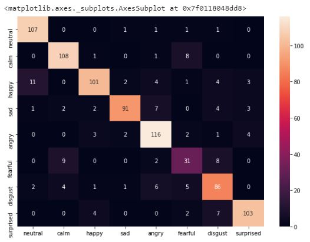

# Speech-emotion-recognition

## Building Models
Using sequential model from Keras framework by having few Dense Layer with regularizer and Dropout Layer to prevent from overfitting.

## Result
* Accuracy: **97%**
* Validation accuracy: **86%**

* Loss: 0.3079
* Validation loss: 0.6972

## Metric
* Confusion matrix

## Future Work
* Upload complete .ipynb file
* Better Exploratory Data Analysis (EDA)
* Validate data
* User input
* Group categories
